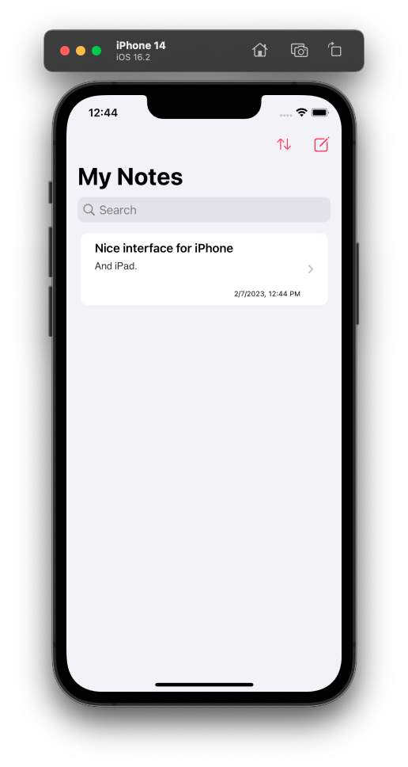

#  smpl notes

Un cuaderno virtual para registrar notas. El proyecto tiene la arquitectura MVVM y soporta iOS, iPadOS y macOS.
- `SwiftUI` como framework visual.
- `NavigationSplitView` para manejar el listado de notas y navegación.
- Utiliza `CoreData` para persistencia de datos. (Con ayuda de [CoreDataRepository](https://github.com/roanutil/CoreDataRepository) ).

## Funciones implementadas

- CRUD: Se puede crear una nueva nota, listar las notas existentes, abrir y editar la nota, y borrar una nota.
- Ordenación: Se puede elegir si las notas aparecen ordenadas por fecha, titulo o contenido. Y si es ascendente o descendente.
- Busqueda: Se puede escribir un texto de busqueda, y la lista de notas se actualiza con las notas cuyo título o contenido contengan el texto.

## Screenshots

## Bugs actuales

- Al crear una nueva nota, es posible que la selección en la lista se confunda

- En macOS, editar un campo de texto en algún punto que no sea el final mueve el cursor hasta el final del campo
